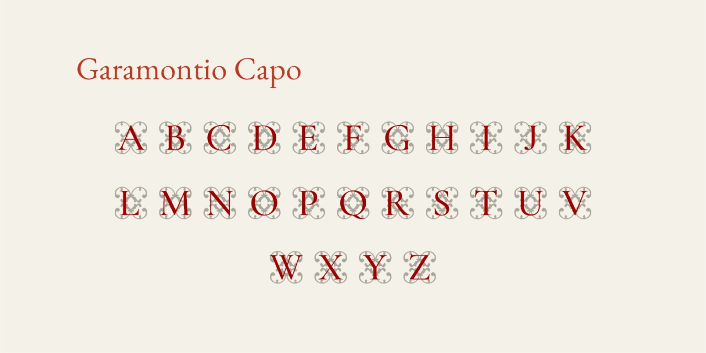

# Garamontio Capo
* Versione 1.126: fix minori
* Versione 1.125: sistemazione dei caratteri e creazione dei due livelli (_ss01_ e _ss02_) per capolettera bicolore
* Versione 1.0: versione iniziale

Per testare il font, vedere la [pagina interattiva](https://m-casanova.github.io/GaramontioCapo/).

## Descrizione

Il font "Garamontio Capo" è basato su capolettera rinascimentali (_Renaissance-Initialen_) <a target="_blank" href="https://archive.org/details/schriftenatlasei02petz/page/n187/mode/2up">pubblicati da Ludwig Petzendorfer nel 1889</a>.

Sono presenti solo i caratteri da A a Z.

Questo capolettera appare adatto per essere abbinato a [Garamontio](https://github.com/m-casanova/Garamontio).
È possibile avere le lettere divise in due distinti elementi per ottenere capolettera bicolori. 

