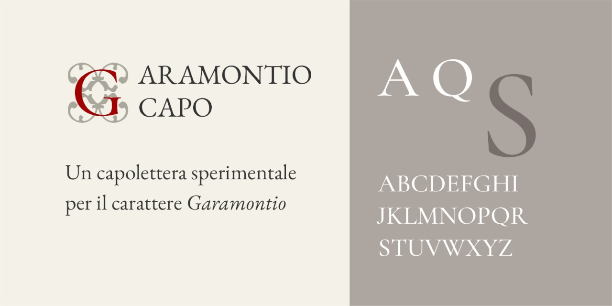

# Garamontio Capo
* Versione 2.101: + decorazioni per 9 e 0
* Versione 2.000: nuova versione da [Cormorant Garamond](https://github.com/CatharsisFonts/Cormorant)
* Versione 1.129: fix lettera /H
* Versione 1.128: fix lettere /C /E /F /G
* Versione 1.127: fix lettere /O /P /R /D
* Versione 1.126: fix minori
* Versione 1.125: sistemazione dei caratteri e creazione dei due livelli (_ss01_ e _ss02_) per capolettera bicolore
* Versione 1.0: versione iniziale

Per testare il font, vedere la [pagina interattiva](https://m-casanova.github.io/GaramontioCapo/).

## Descrizione

La versione 2 del font _Garamontio Capo_ è basata su _[Cormorant Garamond](https://github.com/CatharsisFonts/Cormorant)_ di Christian Thalmann, con alcune modifiche e con l'aggiunta di alcuni sfondi derivati dalle decorazioni di fine Cinquecento. Sono presenti solo le lettera da A a Z.

Oltre alle semplici lettere maiuscole è possibile combinare gli sfondi (numeri da 1 a 8) con le versioni centrate delle lettere (utilizzando stylistic set _ss01_)

I dieci sfondi disponibili (accessibili tramite le singole cifre 1, 2, 3, 4 , 5, 6, 7, 8, 9, 0)

Un esempio di abbinamento a [Garamontio](https://github.com/m-casanova/Garamontio)

